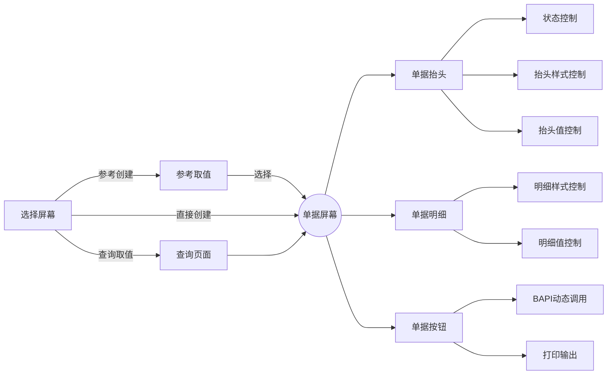

# 业务需求概览

SAP系统业务逻辑足够强大,但是缺乏一个易用性的UI.

本程序提供一个通用的UI页面,支持快速实现定义一个抬头项目的业务单据,并支持以下功能.

-   CURD,新增,修改,查询,删除
-   动态调用各类系统标准函数/BAPI
-   参照其它业务数据
-   GOS服务
-   RFC调用和IDOC接口调用
-   EXCEL模板化输出
-   HTML打印输出
-   长文本模板化输入,修改

# 数据结构设计

## 数据表

-   ZAFO_HEAD	AFO抬头表
-   ZAFO_ITEM	AFO项目表

## 配置表

### 单据对象配置

-   ZAFO_OBJECT	定义单据对象
-   ZAFO_SCREEN	定义单据屏幕字段
-   ZAFO_SCREEN_TEXT	屏幕字段多语言支持
-   ZAFO_OBJECT_ACT	定义单据按钮和执行规则 

### 单据业务类型配置:

-   ZAFO_BUSTYPE	定义业务类型
-   ZAFO_DICT	定义业务自定义字段字典 
-   ZAFO_SEL_SCREEN	定义对象选择屏幕字段
-   ZAFO_SEL_VALUE	定义选择屏幕初始值 
-   ZAFO_NOTES_ALLO	长文本模板分配 
-   ZAFO_PRINT_ALLO	打印模板分配

### 单据执行规则

-   ZAFO_RULE	动作规则配置
-   ZAFO_RULE_DETAIL	动作执行字段映射规则
-   ZAFO_RULE_CODE	动作代码例程

### 单据长文本模板配置

-   ZAFO_NOTES	长文本模板配置

### 单据XLSX输出

-   ZAFO_PRINT_RULE	定义XLSX输出规则
-   ZAFO_PRINT_RULED	定义XLSX字段映射

### 容差配置

-   ZAFO_UEB_GROUP	容差组 

### 配置视图簇

-   ZAFO 动态单据配置(SM34)


# 程序设计概要

## 依赖

该程序的打印部分依赖开源包ZABAP2XLSX,个人工具包ZWFTOOLS.ALV处理部分依赖开源项目ZFALV,已集成到ZWFTOOLS中.

ZABAP2XLSX少量调整,zcl_excel_rows类中增加方法copy_rows.

## 概览

-   ZAFO	REPORT功能程序

​		程序主入口,实现选择屏幕控制,参考业务取值,事务代码定义.

-   ZAFO_BASIC	ZAFO基础类

​		定义配置获取缓存方法和少量其它公共方法

-   ZAFO_CLASS 单据类

    单据对象类,主要功能都在其中

-   ZAFO	单据屏幕函数组(SAPLZAFO)

​		定义屏幕,传递事件到ZAFO_CLASS中处理

-   ZAFO_RUN	动作执行类

​		实现单据对系统内函数的配置化调用

-   ZAFO_PRINT_EXCEL	打印到EXCEL


​		EXCEL模板化打印实现,依赖ZABAP2XLSX

-   业务对象ZAFO

​		实现GOS服务,通过函数ZAFO_CREATE发布IDOC接口.

# 主要功能实现




## 1. 选择屏幕

-   关键配置
    -   ZAFO_BUSTYPE-BUSREF_CONTROL 参考控制
    -   ZAFO_SEL_SCREEN 选择屏幕样式控制
    -   ZAFO_SEL_VALUE 选择屏幕值控制

-   ZAFO REPORT程序中定义(INCLUDE ZAFO_SEL).
-   **动作**:CRE创建/REF参考创建/DIS查询

-   根据配置表ZAFO_BUSTYPE,获取当前事务码分配的业务类型,作为下拉项,默认显示第一个业务.改变**业务类型**或者**动作**,则选择屏幕刷新.
-   通过参考控制(ZAFO_BUSTYPE-BUSREF_CONTROL),控制选择屏幕**动作**的有效性.查询保持显示.
    1. 无参考:只有创建,隐藏参考创建
    1. 强制参考:只有强制参考,隐藏创建
    1. 兼容模式:创建/参考创建同步显示
-   通过配置表ZAFO_SEL_SCREEN控制选择屏幕的显示,支持按照SELECT-OPTION名称或分组显示.可以设置其只读

    1.   可以按照**动作**分别配置显示的按钮组

    2.   可以直接按照选择条件的名称进行分配,可以配置只读
    3.   可以按照组分配选择条件
    4.   业务类型和工厂默认显示,一般使用P_WERKS,特定类型使用多选S_WERKS.
    5.   目前选择条件,按钮见附表-选择条件清单.
-   查询时默认显示DIS分组.
-   初始值:通过配置表ZAFO_SEL_VALUE可以配置某个SELECT-OPTION的初始值,配合只读配置可以动态实现某个业务类型只可以操作某部分数据(例如采购订单的采购组/特定物料类型或仓库的库存).
-   特殊选择模式
    -   供应商:支持F4模糊搜索,支持名称,编号,检索项的模糊搜索.
    -   客户:支持F4模糊搜索,支持名称,编号,检索项的模糊搜索.
    -   物料号:支持物料编号,物料描述的模糊搜索.
-   选择对应的**动作**和**业务类型**,显示对应配置的选择条件;当**动作**和**业务类型**变更时,变更屏幕的选项样式和初始值.

## 2. 参考取值

-   关键配置: 
    -   ZAFO_BUSTYPE-BUSREF **参考取值类型**
    -   ZAFO_BUSTYPE-BUSTYP_REF  参考前序业务类型
    -   ZAFO_BUSTYPE-BUSTYP_REF  备选前序业务类型
-   当选择参考创建时,根据选择屏幕选项和**参考取值类型**指定的特定取值逻辑,获取数据到参考页面选取参考.

参考取值类型X/Y为特殊类型,获取ZAFO_HEAD/ZAFO_ITEM的的前序业务单据执行选择.例如前序是领料申请,后续为领料出库单,或者前序为调出单,后续为调入单.

-   X为行参考,即后续单据可以选前序的某些行执行

-   Y为整单参考,选择时只能选择前序的一单的所有行.

-   参考业务类型简述(程序ZAFO  INCLUDE ZAFO_F02)

    | 类型 | 描述                 | 关键表                                                       |
    | ---- | -------------------- | ------------------------------------------------------------ |
    | A    | 采购收货参考         | EKKO,EKPO,EKKT                                               |
    | B    | 一般库存参考         | MARD                                                         |
    | C    | 一般+订单库存参考    | MARD,MSKA                                                    |
    | D    | 生产订单采购参考     | CDS:ZVPP_MRP_NET<br />详见MRP逻辑实现详解                    |
    | E    | 订单库存参考         | MSKA                                                         |
    | F    | 生产报工             | CDS:ZAFO_MO_CONF<br />AFVC,AFVV,CRHD,AFKO,AFPO               |
    | G    | 采购原单退货         | EKKO,EKPO,EKKT                                               |
    | H    | 生产发料             | RESB,AFKO,AFPO,JEST                                          |
    | I    | 生产退料             | AUFM,AFKO,AFPO                                               |
    | J    | 生产入库             | CDS:ZAFO_MO_GR<br />AFKO,AFPO                                |
    | K    | 参考工序外协加工     | CDS:ZAFO_MO_CONF;ZAFO_DONE_SUM<br />AFVC,AFVV,CRHD,AFKO,AFPO;ZAFO_HEAD,ZAFO_ITEM |
    | L    | 生产订单抬头参考     | CDS:ZAFO_MO_HEAD<br />AFKO,AFPO                              |
    | O    | O库存                | MSLB                                                         |
    | Y    | 前序参考(整单引用)   | ZAFO_HEAD                                                    |
    | Z    | 前序参考(只引用一次) | ZAFO_ITEM                                                    |
    | 其它 |                      | 物料:CDS:ZMAT_V_MARA_EX<br />工厂:T001W<br />仓库:T001L<br />供应商:LFA1 |

-   获取数据后,按照本单据的行样式显示其明细数据,具体逻辑参考**明细样式控制**

-   X/Y类型的显示,使用其前序单据的配置进行**明细样式控制**

-   参考屏幕相对于明细样式增加多选框,增加全选,取消选择,确认选择按钮

    -   当没有使用方块选中行时,全选为全部勾选;否则只勾选选中部分
    -   取消全选,取消所有勾选
    -   确认选择,将勾选的数据传入单据页面

-   选择行时调用屏幕,填充抬头数据.根据ZAFO_SCREEN表中HEAD配置,一样的字段从ITEM写入HEAD,如果HEAD必须字段不唯一,则报错.

-   如果为X/Y的参考,将AFONO/AFONR单号,写入ITEM的AFONO_REF/AFONR_REF字段,清空AFONO,AFONR.

-   为每一个选中行生成唯一行号ID.每个加1.

## 3. 查询页面

-   关键配置:
    -   ZAFO_SCREEN 屏幕控制
-   选择查询时,根据选择条件获取ZAFO_HEAD,ZAFO_ITEM的数据.
-   选择页面分别参考配置屏幕控制的HEAD/ITEM部分显示上下两部分ALV.具体逻辑参考**明细样式控制**.
-   单号可以点击,调用单据屏幕显示该单据
-   双击抬头,则明细部分只显示该单据的明细.

## 4. 单据屏幕

-   关键配置:

    -   ZAFO_OBJECT-HEAD_DYNNR 抬头屏幕号
    -   ZAFO_SCREEN  屏幕样式控制

-   单据屏幕分为以下几部分:

    ```mermaid
    graph LR
    主屏幕200---抬头子屏幕210---公共抬头屏幕400
    主屏幕200---长文本子屏幕220
    主屏幕200---扩展字段子屏幕230
    抬头子屏幕210---抬头特定屏幕号4*
    主屏幕200---明细ALV
    
    ```

-   抬头子屏幕400及4*,请看单据抬头的相关说明.

-   长文本子屏幕220:

    -   长文本维护屏幕
    -   支持选择预配置的类型,选择后写入长文本框(配置:ZAFO_NOTES_ALLO)
    -   支持全屏预览长文本.
    -   支持HTML富文本编辑框
    -   保存时根据单号AFONO生成长文本对象,查询时显示.

-   扩展字段子屏幕230:

    -   预制字段DICT01-DICT10,写入ZAFO_HEAD抬头表.
    -   通过ZAFO_SCREEN屏幕控制配置其可编辑,字段名,必填等属性
    -   通过ZAFO_DICT配置其每个字段的下拉选项的KEY及名称. 

-   当创建或参考创建时:

    -   初始化屏幕时,根据选择屏幕上的唯一工厂或者参考创建的唯一选中工厂,获取各类组织架构.包括公司,销售组织,采购组织,及各组织架构的描述.
    -   根据ZAFO_SCREEN中各字段的ZDEFAULT初始化抬头或者项目的默认值(有值不覆盖).若配置为程序内现有字段(例如SY-DATUM/SY-UNAME)等,则按照变量值初始化(EAVL).
    -   若ITEM为空,初始化10个空行,状态为空未保存.保存时若还是该状态则自动删除.
    -   参考时,只有ITEM_STATUS为C/S的状态可以选择.

-   单据启用GOS服务,业务对象为ZAFO.后续生成的单据挂GOS关系.双击AFONO单号直接打开关系浏览器.

-   打开屏幕时若单号不为空,则锁定ZAFO_HEAD表对象,若锁定失败则状态确定为L.

## 5. 单据抬头

-   关键配置:
    -   ZAFO_OBJECT-HEAD_DYNNR 抬头屏幕号
    -   ZAFO_SCREEN  屏幕样式控制
-   400屏幕为固定屏幕
-   通过ZAFO_OBJECT-HEAD_DYNNR确定需要的子屏幕,子屏幕清单如下:

| 屏幕号 | 名称           | 关键字段                                                     |
| ------ | -------------- | ------------------------------------------------------------ |
| 401    | 供应商一般屏幕 | LIFNR 供应商<br />BUKRS 公司代码<br />LGORT 仓库             |
| 402    | 领用单一般屏幕 | BUKRS 公司代码<br />KOSTL 成本中心<br />LGORT 仓库           |
| 403    | 移库屏幕       | WERKS 发出工厂<br />LGORT 发出仓库<br />UMWRK 收货工厂<br />UMLGO 收货仓库 |
| 404    | 采购订单       | BUKRS 公司代码<br />LIFNR 供应商<br />EEIND 交期<br />LGORT 仓库<br />EKGRP 采购组<br />MWSKZ 税码<br />BSART 订单类型<br />WAERS 币种 |
| 405    | 销售订单       | VKORG 销售组织<br />BUKRS 公司代码<br />KUNNR 客户<br />EEIND 交期<br />AUART 订单类型<br />WAERS 货币 |
| 406    | 交货单         | LFART 交货类型<br />LGORT 仓库<br />KUNNR 客户               |
| 407    | 跨公司移库抬头 | WERKS 发出工厂<br />LGORT 发出仓库<br />UMWRK 收货工厂<br />UMLGO 收货仓库 |
| 408    | 费用登记抬头   | BUKRS 公司代码<br />LIFNR 供应商<br />KOSTL 成本中心<br />WAERS 币种 |
| 409    | 采购申请抬头   | BUKRS 公司代码<br />LIFNR 供应商<br />KOSTL 成本中心<br />EKGRP 采购组<br />BSART 订单类型<br />EEIND 交期 |
| 410    | 领用单一般屏幕 | BUKRS 公司代码<br />KOSTL 成本中心<br />LGORT 仓库<br />LIFNR 供应商 |
| 411    | 销售采购合并   | BUKRS 公司代码<br />LIFNR 供应商<br />KUNNR 客户<br />EEIND 交期<br />WAERS 币种 |

## 6. 状态控制

-   只读控制READONLY

-   核心状态控制HEAD-STATUS

    -   空 
    -   A	已保存 

    -   B	已提交 

    -   C	已审核 

    -   D	已作废 

    -   L	已锁定 

    -   S	已过账 

    -   T	已被引用

-   初始为空,保存后更新为A.

-   A状态提交后如果有审批类型(ZAFO_OBJECT-APP不为空)则到B,否则C已审批.

-   B状态可以审批/取消提交

-   C状态可以取消提交/取消审批(ZAFO_OBJECT-APP不为空)

-   A状态作废后为D,D状态不能有任何操作

-   单据被其它人锁定为L,L状态不能有任何操作

-   A(ZAFO_OBJECT-APP为空)/C(ZAFO_OBJECT-APP不为空)状态过账后为S,S状态只能冲销

-   C/S状态单据被其它单据引用(参考类型X/Y)后为T,不可以有任何操作

## 7.  抬头样式控制

-   描述类型的字段(例如供应商描述)为只读.
-   其它抬头字段的显示/隐藏,只读/可编辑,必填(假必填,屏幕不报错,保存时再报错),由配置ZAFO_SCREEN中的HEAD配置控制.
-   抬头字段的字段名称标签支持多语言,打开屏幕时动态生成,确认优先级从高到低如下:
    1.   ZAFO_SCREEN_TEXT中本类型,本语言的描述
    2.   ZAFO_SCREEN中的本类型配置
    3.   ZAFO_SCREEN_TEXT中无类型,本语言的描述

-   通用屏幕400,一般由ZAFO_SCREEN_TEXT中无类型,本语言的描述确定,减少配置量.
-   当全局状态READONLY为X时,所有抬头字段不可编辑.

## 8. 抬头值控制

-   抬头组织架构等选项,采用下拉框.有些使用F4搜索帮助.
-   下拉框的组件,由函数组SAPLZAFO中屏幕MOUDLE初始化,考虑组织架构.例如成本中心,由公司代码筛选.所有下拉组件,支持ZAFO_DICT中通过业务类型,工厂(工厂为空则该业务类型全有效)配置该字段,若有配置则只显示配置的选项.
-   供应商和客户支持直接输入模糊搜索,在采购组织/销售组织范围,模糊匹配其编码/描述/检索项,若只匹配一个则直接返回编号和描述,多行则弹窗选择后返回编号和描述.客户和供应商返回币种/税码.

## 9. 单据明细

-   若ITEM为空,初始化屏幕时填充10个空行.
-   通过ZAFO_SCREEM中ITEM的字段配置,初始化默认值(不覆盖).

## 10. 明细样式控制

-   明细字段参考表ZAFO_ITEM,通过ZAFO_SCREEN中的ITEM部分控制其显示的列数和顺序.
-   默认状态灯,状态文本,行号在最前,其它字段由配置控制.
-   可以配置每个字段的列名,默认值,可编辑,颜色,默认长度等样式.ZAFO_SCREEN-STYLE支持HOTSPOT,CHECKBOX,LIST下拉框,F4等样式的指定.
-   查询功能的HEAD/ITEM显示,参考选择时的数据显示样式,跟这里基本一致.
-   当全局状态READONLY为X时,所有明细字段不可编辑.

## 11. 明细值控制

-   某行值变化时,更新该行的状态等为黄色,状态描述为已维护.

-   物料:
    -   支持直接输入模糊搜索编号和名称或者F4.
    -   筛选组织架构,只显示该工厂的物料.
    -   通过ZAFO_DICT中的配置MTART和MATKL的值,通过物料类型和物料组筛选特定物料.
    -   若返回只有1,则直接返回物料号
    -   确定物料号后,根据ZMAT_MARA表值,返回更新该行的物料描述,成分,颜色,有效门幅,克重等信息.
-   物料组:
    -   支持物料组的模糊查询编码和名称或者F4
    -   支持通过ZAFO_DICT配置执行过滤.
-   计量单位:
    -   定制转换里程ZMEIN,支持自动显示计量单位为中文.输入中文自动输入转义系统单位.
-   单价(PRICE_LONG,6位小数)
    -   输入后自动转换到两位的价格PRICE和价格单位PEINH,例如长单价为1.3567,转换为价格135.67,价格单位100.
    -   重新计算金额AMOUNT,公式为金额=数量*价格/价格单位
-   数量
    -   重新计算金额AMOUNT,公式为金额=数量*价格/价格单位
-   款号/目标款号
    -   支持输入款号模糊搜索,若返回唯一则直接返回工单号/销售订单号/销售订单行号,若多行则弹出框选择生产订单的款号.

## 12. 单据按钮

-   单据按钮选择由状态决定,再由配置ZAFO_OBJECT_ACT过滤.
-   状态的按钮分配如下表:

| 状态 | 状态描述   | 只读 | 可执行操作                                                   | 执行后状态                                                  |
| ---- | ---------- | ---- | ------------------------------------------------------------ | ----------------------------------------------------------- |
| 空   | 未保存     |      | 保存(&SAVE)                                                  | A,只读                                                      |
| A    | 已保存     |      | 保存(&SAVE)                                                  | A,只读                                                      |
| A    | 已保存     | X    | 编辑(&EDIT)<br />提交(&COMMIT)<br />过账(&POST)<br />删除(&DELETE)<br />打印(&PRINT) | A,非只读<br />B或C,只读<br />S,只读<br />D,只读<br />A,只读 |
| B    | 已提交     | X    | 审批(&APPROVE)<br />取消提交(&UNCOMMIT)                      | C,只读<br />A,只读                                          |
| C    | 已审批     | X    | 取消提交(&UNCOMMIT)<br />取消审批(&UNAPPROVE)                | A,只读<br />B,只读                                          |
| D    | 已作废     | X    | 无                                                           |                                                             |
| L    | 已锁定     | X    | 无                                                           |                                                             |
| S    | 已过账     | X    | 冲销(&CANCEL)<br />打印(&PRINT)                              | D,只读<br />S,只读                                          |
| T    | 后续已完成 | X    | 打印(&PRINT)                                                 | T,只读                                                      |

-   保存(&SAVE)
    -   合计抬头总数量,总金额
    -   检查抬头和项目的必填性,删除初始状态的行,判断行不为空.
    -   将抬头必填字段,赋值到项目的一致字段,覆盖.
    -   执行ZAFO_OBJECT_ACT中配置的保存RUN规则,返回错误则终止报错
    -   若单号为空,生成单号,确定创建日期/日期/人,更新修改时间/日期/人.
    -   保存长文本对象
    -   关联RUN返回的业务单据到ZAFO本单对象.
    -   若该订单ITEM中的AFONO_REF不为空,则更新该参考订单的抬头/行状态为T,且该参考单的行字段AFONO_FLOW/AFONR_FLOW更新为本行单号/行号.
    -   更新READONLY为X.
-   编辑(&EDIT)
    -   修改READONLY只读为空.
-   提交(&COMMIT)
    -   执行ZAFO_OBJECT_ACT中配置的保存RUN规则,返回错误则终止报错
    -   更新状态为B或C(ZAFO_OBJECT-APP为空则B).
-   取消提交(&UNCOMMIT)
    -   执行ZAFO_OBJECT_ACT中配置的保存RUN规则,返回错误则终止报错
    -   更新状态为A.
-   审批(&APPROVE')
    -   执行ZAFO_OBJECT_ACT中配置的保存RUN规则,返回错误则终止报错
    -   更新状态为C.
-   取消审批(&UNAPPROVE)
    -   执行ZAFO_OBJECT_ACT中配置的保存RUN规则,返回错误则终止报错
    -   更新状态为B.
-   过账(&POST)
    -   执行ZAFO_OBJECT_ACT中配置的保存RUN规则,返回错误则终止报错
    -   更新状态为S.
-   冲销(&CANCEL)/作废(&DELETE)
    -   执行ZAFO_OBJECT_ACT中配置的保存RUN规则,返回错误则终止报错
    -   若该订单ITEM中的AFONO_REF不为空,则更新该参考订单的抬头/行状态为S/C,且该参考单的行字段AFONO_FLOW/AFONR/FLOW更新为空.
    -   更新状态为D.
-   打印(&PRINT)
    -   执行打印输出,状态无关.

## 13. bapi动态调用

1.   可以使用程序ZAFO_RULE程序配置字段映射和设置例程代码,支持代码检查.
2.   通过ZAFO_OBJECT_ACT执行的动作和当前的创建/修改操作,确定规则RULE_NAME,空则不执行.

3.   通过RULE_NAME获取ZAFO_RULE规则抬头/ZAFO_RULE_DETAIL的规则明细/ZAFO_RULE_CODE的代码例程明细,动态调用功能函数执行该业务.类ZAFO_RUN.
4.   若有代码例程,则按照配置规则和例程模板ZAFO_RULE_ROUTINE_TEMPLATE,生成动态类,按照配置的属性标签替换将代码插入模板的指定位置.激活代码如果有错则报错.
5.   获取ZAFO_RUN配置的函数名的全部参数.
6.   为配置中的BAPI参数创建动态数据结构或者表,已经其同名加X的标记结构或表.
7.   对于单一变量/单行变量,按照配置的数据结构HEAD/ITEM第一行赋值数据,或者赋值默认值日.默认值可以ASSIGN到的则赋值变量值.
8.   循环ITEM,给表变量赋值,按照配置取每个ITEM或者HEAD的值,或者赋值默认值日.默认值可以ASSIGN到的则赋值变量值,若该字段有动态类例程代码routine_xxx,则调用该例程代码.
9.   对于有同名的X结构变量或表,同步7的过程执行赋值.若其数据结构与不带X的变量数据结构一致,则赋原值,否则赋值X.
10.   调用函数前调用动态类的routine_before_post方法,检查或调整数据.
11.   将参数调用BAPI,获取其返回参数.返回参数用RETURN配置接收.RETURN TABLE支持结构表BAPIRET1/BAPIRET2/BAPIVBRKERRORS/BAPI_CORU_RETURN/BAPIRETURN.其它表也可以通过字段配置映射到类的RETURN表.
12.   调用函数后调用动态类的routine_after_post方法,检查或调整数据.
13.   将RETURN结构转移到ZAFO_RUN的RETURN中,返回单号到DOCNO中(某些对象带年份).
14.   返回ZAFO_RULE中配置的业务对象类型,拼装其对应的KEY.(例如物料凭证BUS2017,KEY为凭证号+年份).
15.   返回后由ZAFO_CLASS中绑定AFO单号和该对象.
16.   目前不支持一个按钮触发多个BAPI,可以考虑通过ZAT的处理逻辑实现多级顺序处理(例如高定业务).

## 14. 打印输出

-   打印按钮调用ZAFO_PRINT_EXCEL类执行打印.
-   通过ZAFO_PRINT_ALLO确定该业务类型的可用打印配置.
-   通过ZAFO_PRINT_RULE规则抬头/ZAFO_PRINT_RULED规则明细配置数据.
-   通过OAOR,类名称ZAFO,分类类型OT上传维护EXCLE打印模板
-   依赖开源ABAP工程ZABAP2XLSX.
-   EXCEL中使用名称管理器定义EXCLE端变量,包括表格区域.
-   大致执行逻辑如下:
    1.   若配置多个,则弹框给用户选择某一个
    2.   根据配置规则获取模板(ZAFO_RULE-TEMPLATE),加载到ZABAP2XLSX类对象.
    3.   若配置中有数据来源结构*_BP_INFO,则根据其字段值获取BP的名称,地址,电话等信息,用于赋值.
    4.   若配置中有数据来源结构MAT_INFO,则按照数据中的物料号的描述,单位,分类,成分等信息,用于赋值.
    5.   按照配置,取HDATA->*的值赋值给EXCEL中的普通RANGE对象.若EXCEL RANGE对象中有关键字[VALUE],则替换为明细配置中的指定值.支持一个EXCEL RANGE 按配置顺序连续替换多个[VALUE].
    6.   对于表格对象(TABLE开头,可以多个),首先调整该表格对象的行数与ITEM行数一致.再按顺序每列赋值.
    7.   值转换:
         -   若配置例程CNDAT,则转换为YYYY年MM月DD日的格式,
         -   若数字,则去除多余的小数0,不显示唯一0.
         -   配置例程CNNUM,则将金额转换为大写中文输出.
         -   若其它转换例程,则调用该例程的OUTPUT函数转义输出.
    8.   若ZAFO_RULE中配置了密码,则按照该密码保护该EXCEL不可编辑.
    9.   跳出选择路径,让用户选择保存路径
    10.   输出保存该EXCEL文件,直接打开.
-   

# 额外功能

##	1. 采购容差配置

关键配置:ZAFO_UEB_GROUP

通过ZAFO_SCREEN给业务类型分配UEB_GROUP,通过配置表和容差组,按数量区间确定交货容差的上限/下限/无限制.参考或者修改数量时触发.

## 2. HTML输出预览

此外所有单据标准打印按钮,目前通过ZWFT_HTML直接网页预览.支持CSS样式.支持打印.

## 3. 标准翻页功能实现

列表打开某一单时,通过ZAFO_BASIC=>SET_LISTS( )设置列表清单,点击上下翻页/首页/尾页时通过全局列表ZAFO_BASIC=>LIST获取对应单号,实现即时翻页跳转.

目前查询列表和审批列表使用该功能.

## 4. 通过GOS对象实现附件

可以通过左上角的GOS服务实现标准的附件实现.

通过GOS关联实现后续单据的关联与跳转.

## 5. 接口函数实现

函数ZAFO_CREATE,挑选常用字段组成HEAD/ITEM定义该函数.

SWO1定义业务对象ZAFO,业务对象创建API方法CREATE参考功能函数ZAFO_CREATE.

BDBG将该方法定义为IDOC对象.支持IDOC接口.

ZAFO_CREATE也可以发布WEBSERVICE.

定义DISPLAY方法实现其它单据通过GOS跳转打开ZAFO单据.

## 6. 外部执行方法

ZAFO_CLASS=>CREATE( ),直接调用某个单据的空白创建

ZAFO_CLASS=>CREATE_BY_DATA( ),传入数据的创建

ZAFO_CLASS=>MAINTAIN( ),查询或者维护某个单据

ZAFO_CLASS=>ACTION_EXT( ),可以直接执行某个单据的某个按钮功能

## 7. 内外部值转换

函数组ZAFO_EX.

转换例程函数CONVERSION_EXIT_XXXXX_INPUT和CONVERSION_EXIT_XXXXX_OUTPUT

PRICE, 输出时去除多余的小数0(两位的保留).

USER,账号和全名的输入/输出互转.

ZMATK,物料组与其名称的互转.

ZMEIN,计量单位和其名称的互转.

取表部分设置全局BUFFER,大量报表也无性能问题.

## 8. 模糊搜索

ZWFT_COMMON=>SEARCH_VENDOR( ).搜索供应商

ZWFT_COMMON=>SEARCH_CUSTOMER( ).搜索客户

ZWFT_COMMON=>SEARCH_MATERIAL( ).搜索物料

该ZWFT_COMMON类下有需求个人公共方法,在ZAFO中大量使用.

## 9. 修改日志

类ZWFT_LOG_CLASS处理单据的修改动作及值修改,可以点击抬头的LOG图标显示修改日志.

# 附表

## 选择条件清单

| 名称         | 选项     | 类型     | 分组 |
| ------------ | :------- | :------- | ---- |
| 业务类型     | P_TYP    | 下拉选项 |      |
| 工厂         | P_WERKS  | 单值     |      |
| 仓库         | S_LGORT  | 范围     | MB   |
| 工厂         | S_WERKS  | 范围     |      |
| 批次         | S_CHARG  | 范围     | MB   |
| 销售订单     | S_VBELN  | 范围     | SO   |
| 订单类型     | S_AUART  | 范围     | SO   |
| 销售组织     | S_VKORG  | 范围     | SO   |
| 客户         | S_KUNNR  | 范围     | SO   |
| 外部单号     | S_EXORD  | 范围     | SO   |
| 采购订单     | S_EBELN  | 范围     | PO   |
| 采购订单类型 | S_BSART  | 范围     | PO   |
| 采购组织     | S_EKORG  | 范围     | PO   |
| 采购组       | S_EKGRP  | 范围     | PO   |
| 供应商       | S_LIFNR  | 范围     | PO   |
| 采购交期     | S_EEIND  | 范围     | PO   |
| 款号         | S_SATNR  | 范围     | MAT  |
| 物料号       | S_MATNR  | 范围     | MAT  |
| 物料描述     | S_MAKTX  | 范围     | MAT  |
| 物料组       | S_MATKL  | 范围     | MAT  |
| 物料类型     | S_MTART  | 范围     | MAT  |
| 生产订单     | S_AUFNR  | 范围     | AUF  |
| 单据号       | S_AFONO  | 范围     | DIS  |
| 状态         | S_STATUS | 范围     | DIS  |
| 创建人       | S_ERNAM  | 范围     | DIS  |
| 创建日期     | S_ERDAT  | 范围     | DIS  |
| 过账日期     | S_BUDAT  | 范围     | DIS  |


​		

